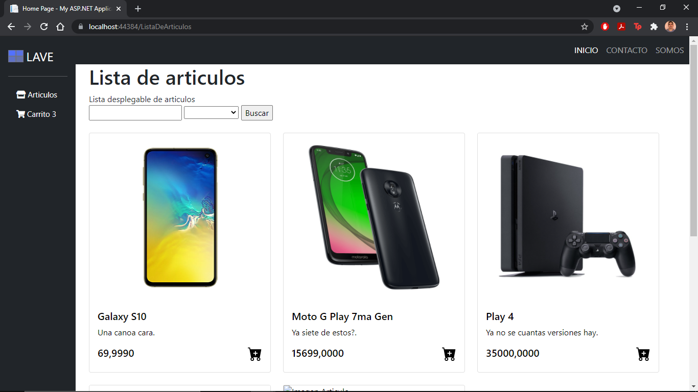
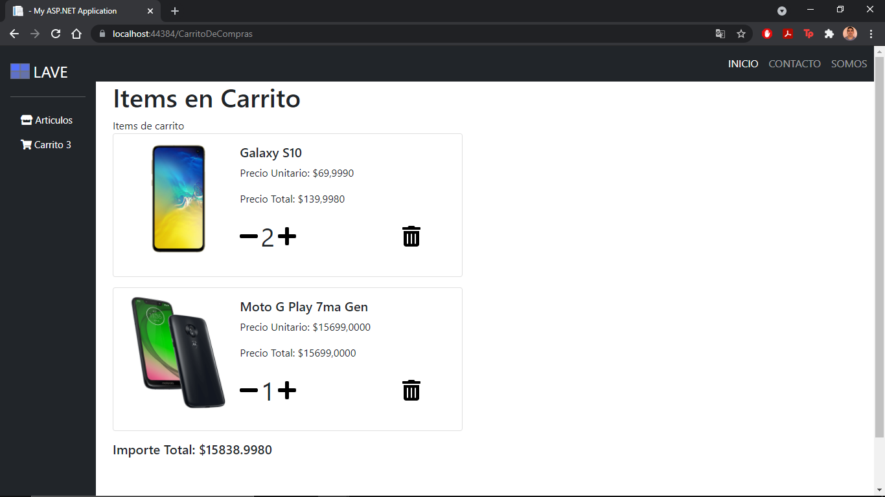

# carrito-web
Repositorio creado para la realización de un carrito de compras web, para la materia de Programación III - UTN FRGP

Este mismo muestra una lista de Articulos cargados en la base de datos, mediante conexion SQL con Ado.Net, y median sesion agrega los articulos al carrito de compras.

Imagenes

